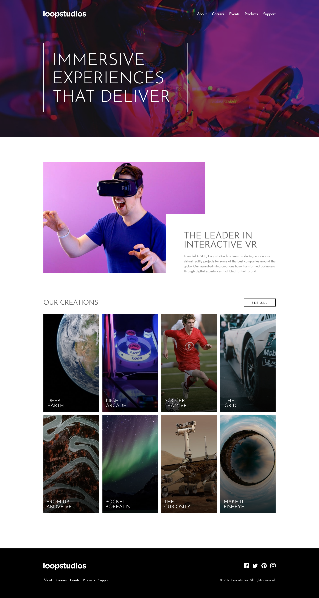

# Frontend Mentor - Loopstudios landing page solution

This is a solution to the [Loopstudios landing page challenge on Frontend Mentor](https://www.frontendmentor.io/challenges/loopstudios-landing-page-N88J5Onjw). Frontend Mentor challenges help you improve your coding skills by building realistic projects. 

## Table of contents

- [Overview](#overview)
  - [The challenge](#the-challenge)
  - [Screenshot](#screenshot)
  - [Links](#links)
- [My process](#my-process)
  - [Built with](#built-with)
  - [What I learned](#what-i-learned)
  - [Continued development](#continued-development)
- [Author](#author)

## Overview

### The challenge

Users should be able to:

- View the optimal layout for the site depending on their device's screen size
- See hover states for all interactive elements on the page

### Screenshot



### Links

- Solution URL: https://www.frontendmentor.io/solutions/responsive-loopstudios-landing-page-using-flexbox-grid-HkPA3nLB5
- Live Site URL: https://pyaethein.github.io/Loopstudios-Landing-Page/

## My process

### Built with

- Semantic HTML5 markup
- CSS custom properties
- Flexbox
- CSS Grid
- Mobile-first workflow
- SASS
- Vanilla JavaScript

### What I learned

- using `mix-blend-mode: multiplay;` on child element to apply overlaying `linear-gradient` from parent element and `display: block;` to take up entire space in order for `linear-gradient` to work
- removing nav menu upon clicking nav links 
- making desktop hero background image responsive using `min-height: auto` on parent element and `padding: 7rem 0` on child element

```html
<!-- hero bg -->
<section class="hero" id="hero">
  <div class="hero__content">
    <h1 class="hero__title title">
      Immersive experiences that deliver
    </h1>
  </div>
</div>
<!-- grid images -->
<div class="events__tab--overlay">
    
</div>
```
```css
/* overlay techique */
.events__tab--overlay{
  background: linear-gradient(to right, rgba(0,0,0,0.5), transparent);
}
.events__tab--img{
  mix-blend-mode: multiply;
  display: block;
}
/* making desktop hero bg responsive */
.hero{
  min-height: auto;
}
.hero__content{
  padding: 7rem 0;
}
```
```js
// removing menu upon clicking links
navLinks.forEach(n => n.addEventListener('click', () => {
  navMenu.classList.remove('active');
  navList.classList.remove('active');
  overlay.classList.remove('active');
  heroContent.classList.remove('active');
}))
```

### Continued development

Looking forward for harder challenges focusing more on `linear-gradient` and responsive images.

## Author

- Frontend Mentor - [@pyaetheiN](https://www.frontendmentor.io/profile/pyaetheiN)
- Twitter - [@pt_boyyy](https://www.twitter.com/pt_boyyy)